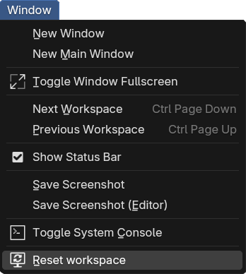

# Reset the workspace !

Messed up your user interface ? Simply save your file and reset it with _Window > Reset Workspace_!

### NOTES
This loads your Startup File (and its ui) then loads back up the current file with "Load ui" unchecked. So you get your current file but with the default ui.

Good Blending :)